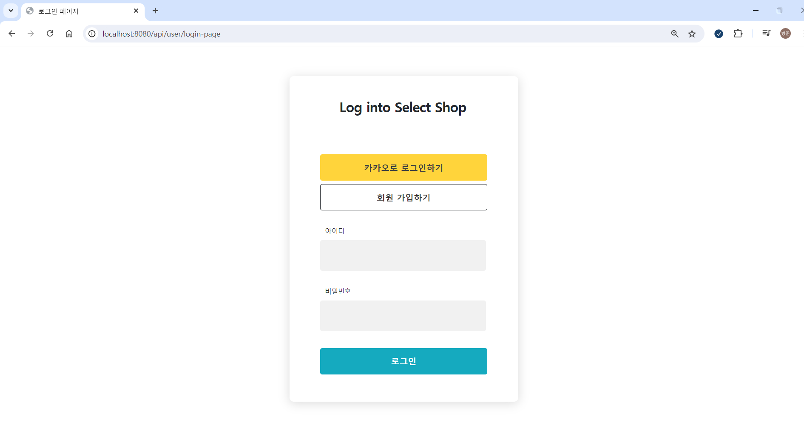
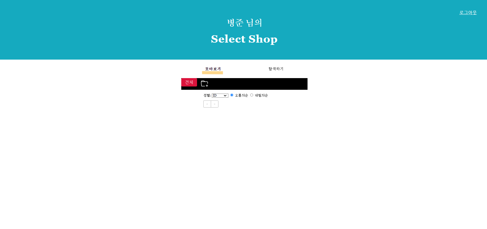
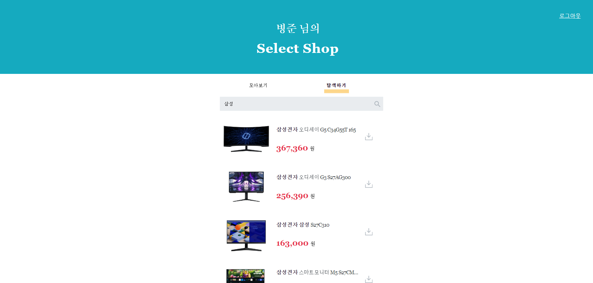
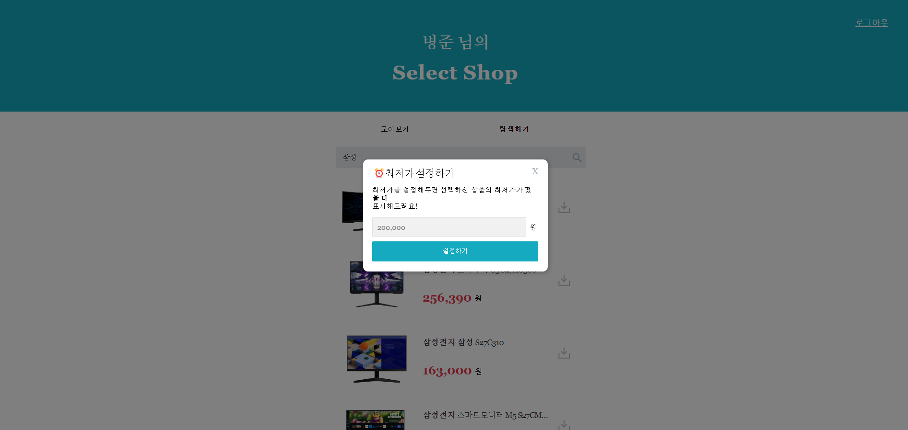
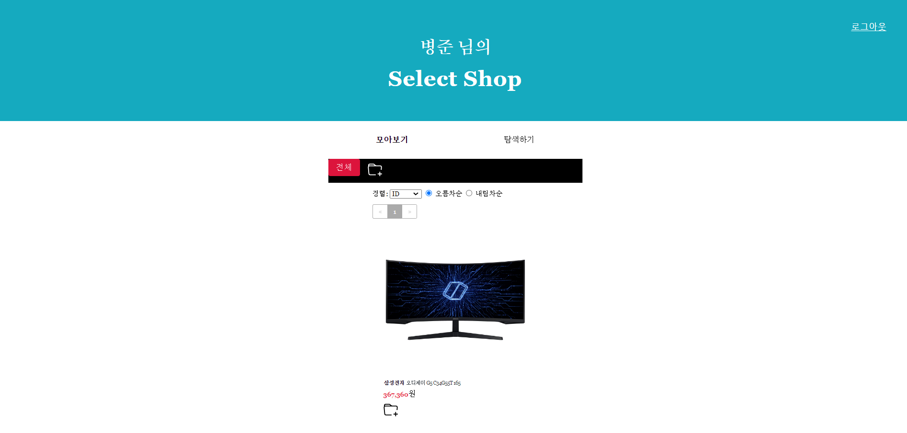
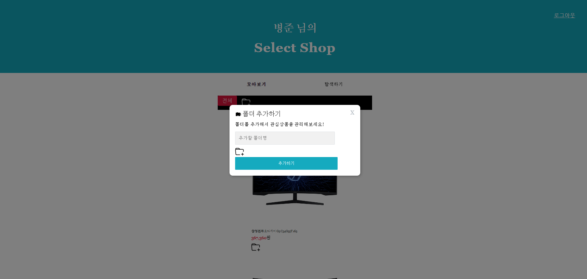
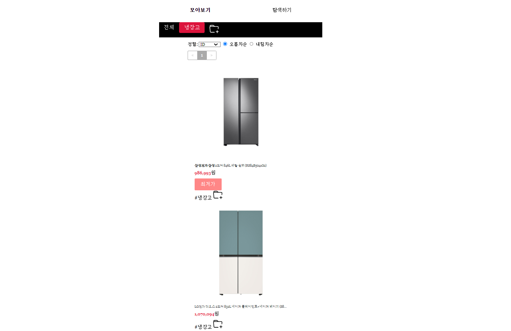
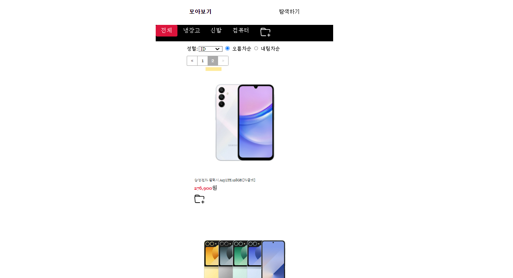

## 📝MySelectShop
1. 카카오 로그인
2. NeverSearchAPI를 사용하여 원하는 상품 찾기
3. 찾아온 상품 모두 보기
4. 폴더 추가하기
5. 폴더에 해당하는 상품 넣어주기
6. 전체 상품에서 Pageable 확인하기

## 기능 보기 👀

* 카카오 로그인

* 등록한 데이터 모두 보기
  * 아직 데이터를 등록하지 않은 상태

* NeverSearchAPI를 사용하여 원하는 상품 찾기

* 상품 최저가 설정하기

* 찾아온 상품 모두 보기

* 폴더 추가하기

* 폴더에 해당하는 상품 넣어주기

* 전체 상품에서 Pageable 확인하기

